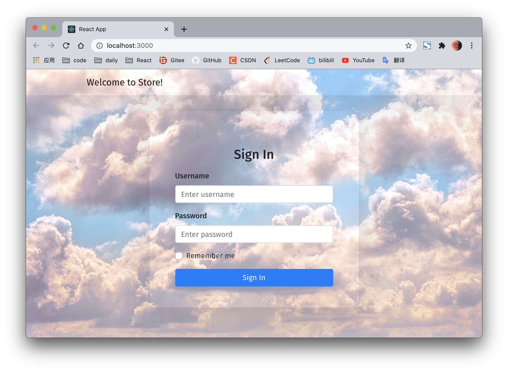
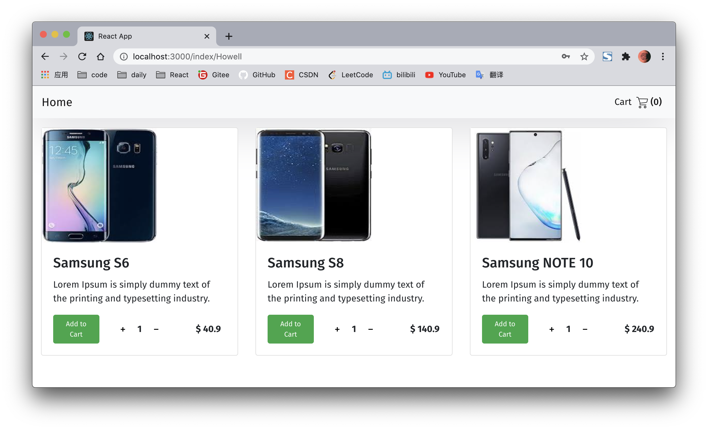
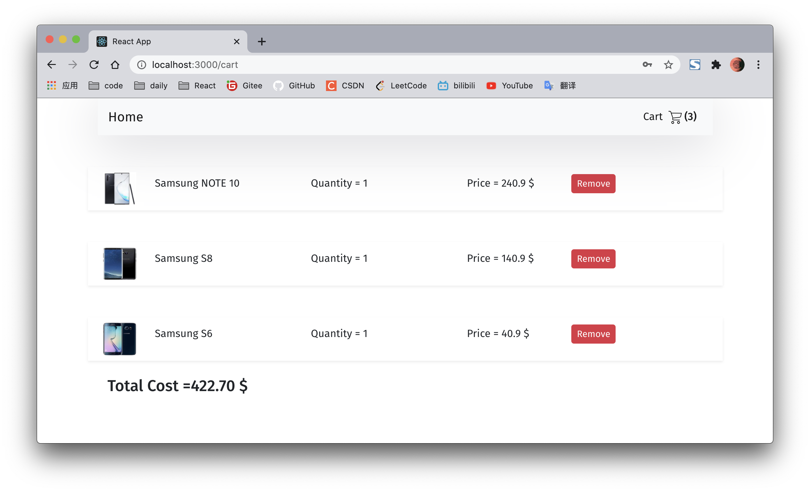

## webapp 前端设计 
|任务|人员|
|:-:|:-:|
|前端及接口测试|伍浩源, 赵文序|

### 0. 实验环境
- 富客户端js框架：`React`
- 操作系统：`Windows 10`  

前端源码连接：[webapp传送门](https://github.com/wuhy68/Go_Webapp_Frontend/tree/master/webapp)

### 1. 安装指南
在终端执行如下命令克隆本项目：
```shell
git clone https://github.com/wuhy68/Go_Webapp_Frontend.git
```
进入webapp文件夹:
```shell
cd webapp
```
若未安装`cnpm`，则先执行：
```shell
npm install -g cnpm
```
安装完成后执行：
```shell
cnpm install
cnpm start
```

### 2. 测试demo
- 测试账号：`Howell`
- 测试密码：`Howell123`

实现UI界面如下：
|登陆界面|
|:-:|
||

|商品页面|
|:-:|
||

|购物车初始页面|
|:-:|
||

|添加商品至购物车|
|:-:|
||